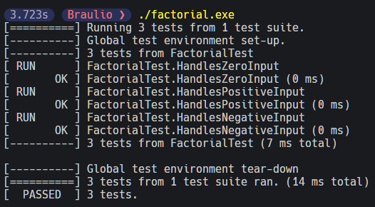
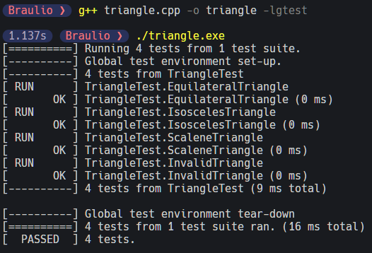

# Instalación y Ejecución de Pruebas con Google Test (GTest)

Google Test, también conocido como GTest, es un marco de pruebas C++ ampliamente utilizado que facilita la escritura y ejecución de pruebas unitarias. Este tutorial te guiará a través del proceso de instalación y ejecución de pruebas utilizando Google Test en C++. Para más informacion visitar la [Documentación de Google Test](https://google.github.io/googletest/)

## Introducción

Google Test es una biblioteca de pruebas unitarias que se utiliza para evaluar el comportamiento de las funciones y componentes de un programa C++. Las pruebas unitarias son esenciales para asegurar que tu código funcione correctamente. Google Test proporciona un entorno de pruebas flexible y poderoso para ayudarte a escribir y ejecutar pruebas de manera efectiva.

## Requisitos

Antes de continuar, asegúrate de tener instalados los siguientes componentes en tu sistema:

- C++
- CMake

A continuación, te guiaré a través de los pasos necesarios para instalar Google Test y ejecutar pruebas en tu entorno de desarrollo C++.

## Índice

- [Instalación MSYS2 con GCC, G++, GDB y Make en Windows](#instalación-msys2-con-gcc-g-gdb-y-make-en-windows)
- [Instalación de CMake en Windows](#instalación-de-cmake-en-windows)
- [Instalación de Google Test en Windows](#instalación-de-google-test-en-windows)
- [Ejecutar Casos de Prueba con Google Test en C++](#ejecutar-casos-de-prueba-con-google-test)
- [Análisis del uso de Test Fixtures en una clase Triangle con GTest](#análisis-del-uso-de-test-fixtures-en-una-clase-triangle-con-gtest)

## Instalación MSYS2 con GCC, G++, GDB y Make en Windows

Sigue estos pasos para instalar MSYS2 con todas las herramientas necesarias:

1. **Descargar MSYS2:**

   - Ve al [sitio web oficial de MSYS2](https://www.msys2.org/) y descarga el instalador adecuado para tu sistema (32 o 64 bits).

2. **Instalar MSYS2:**

   - Ejecuta el instalador que descargaste y sigue las instrucciones del asistente de instalación. Asegúrate de seleccionar la ruta de instalación y las opciones adecuadas según tus preferencias.

3. **Abrir MSYS2:**

   - Una vez instalado, ejecuta "MSYS2 MSYS" desde el menú de inicio. Esto abrirá la terminal de MSYS2.

4. **Actualizar el sistema:**

   - En la terminal de MSYS2, actualiza el sistema y los paquetes a las últimas versiones con los siguientes comandos:

   ```bash
    pacman -Syu
   ```

5. **Instalar GCC y G++:**

   - Para instalar GCC (el compilador de C) y G++ (el compilador de C++), utiliza el siguiente comando:

   ```bash
    pacman -S mingw-w64-x86_64-gcc mingw-w64-x86_64-gcc-c++
   ```

6. **Instalar GDB:**

   - Para instalar GDB (el depurador de GNU), ejecuta el siguiente comando:

   ```bash
    pacman -S mingw-w64-x86_64-gdb
   ```

7. **Instalar Make:**

   - Para instalar Make, utiliza el siguiente comando:

   ```bash
    pacman -S make
   ```

8. **Agregar MSYS2 al PATH:**

   - Para utilizar MSYS2 desde el símbolo del sistema de Windows o desde otras aplicaciones, debes agregar MSYS2 al PATH. Para ello, encuentra la ruta de instalación de MSYS2 (por ejemplo, **C:\Program Files\msys64\mingw64\bin**) y agrega esta carpeta al PATH de Windows. Puedes hacerlo desde la configuración avanzada del sistema en Windows en la ventana variables de entorno.

9. **Verificar la instalación:**

   - Puedes verificar que GCC, G++, GDB y Make estén instalados correctamente ejecutando los siguientes comandos en la terminal de MSYS2:

   ```bash
    gcc --version
    g++ --version
    gdb --version
    mingw32-make --version
   ```

## Instalación de CMake en Windows

CMake es una herramienta ampliamente utilizada para la construcción y gestión de proyectos de software en Windows. Sigue estos pasos para instalar CMake en tu sistema:

1. Descargar el instalador

   - Ve al [sitio web oficial de CMake](https://cmake.org/download/). En la sección "Latest Release," busca la Distribución Binaria de la última versión estable para Windows x64 ZIP. Descarga el archivo ZIP en tu computadora.

2. Ejecutar el instalador

   - Descomprime el archivo ZIP que descargaste. Y copia la carpeta resultante a una ubicación en tu sistema. Por ejemplo, puedes copiarla a `D:\Program Files\CMake`.

3. Configurar la instalación

   - Para agregar CMake al PATH del Sistema, copia la dirección de la carpeta "bin" en la que se encuentra el ejecutable de CMake. La dirección podría ser algo similar a: `D:\Program Files\CMake\cmake-3.28.0-rc3-windows-x86_64\bin`

4. Verificar la instalación

   - Abre una ventana de línea de comandos, como el Símbolo del Sistema o PowerShell. Y ejecuta el siguiente comando para verificar que CMake se ha instalado correctamente:

   ```bash
   cmake --version
   ```

   - Esto mostrará la versión de CMake que has instalado en tu sistema.

## Instalación de Google Test en Windows

Sigue estos pasos para instalar Google Test en Windows:

1. **Clonar el repositorio de Google Test:**

   - Abre una terminal (por ejemplo, MSYS2 o Git Bash).
   - Ejecuta el siguiente comando para clonar el repositorio de Google Test desde GitHub:

     ```bash
     git clone https://github.com/google/googletest.git
     ```

2. **Crear una carpeta de compilación:**

   - En la carpeta recién clonada, crea una carpeta llamada "build". Esto es donde generaremos los archivos de compilación.

3. **Acceder a la carpeta de compilación:**

   - Abre una terminal y navega hasta la carpeta de compilación que acabas de crear:

     ```bash
     cd ruta/a/tu/carpeta/googletest/build
     ```

4. **Generar archivos de compilación:**

   - En la terminal, ejecuta el siguiente comando para configurar los archivos de compilación con CMake y MinGW Makefiles:

     ```bash
     cmake -G "MinGW Makefiles" ..
     ```

5. **Compilar Google Test:**

   - A continuación, compila Google Test ejecutando el siguiente comando:

     ```bash
     make
     ```

   - Si el comando anterior no funciona, intenta con el siguiente comando:

     ```bash
     mingw32-make
     ```

6. **Copiar archivos y carpetas:**

   - Copia los archivos de la ruta `..\googletest\build\lib` y pégalos en `..\msys64\mingw64\lib`.

   - Copia las carpetas `..\googletest\googletest\include\gtest` y `..\googletest\googlemock\include\gmock` y pégalas en `..\msys64\mingw64\include`.

Con estos pasos, habrás instalado Google Test en tu entorno de desarrollo C++ en Windows. Ahora puedes utilizar Google Test para realizar pruebas unitarias en tus proyectos C++.

## Ejecutar Casos de Prueba con Google Test

Para ejecutar los casos de prueba incluidos en el archivo `factorial.cpp`, sigue estos pasos:

1. **Compilar el archivo de prueba:**

   - Abre una terminal en la ubicación del archivo `factorial.cpp`.

   - Ejecuta el siguiente comando para compilar el archivo y generar un ejecutable llamado `factorial.exe`, enlazando con la biblioteca Google Test (`-lgtest`):

     ```bash
     g++ factorial.cpp -o factorial -lgtest
     ```

2. **Ejecutar el programa de prueba:**

   - Una vez que se ha generado el ejecutable, puedes ejecutarlo utilizando el siguiente comando:

     ```bash
     ./factorial.exe
     ```

3. **Resultado esperado:**

   - Tras ejecutar el programa, deberías obtener un resultado similar al siguiente:

     

   - Esto mostrará los resultados de los casos de prueba, indicando si pasaron correctamente o si se encontraron errores.

Con estos pasos, habrás ejecutado con éxito los casos de prueba utilizando Google Test en C++. El archivo `factorial.cpp` contiene casos de prueba para calcular el factorial. Puedes utilizar este flujo para probar tus propios programas y comprobar su comportamiento bajo diferentes condiciones.

## Análisis del uso de Test Fixtures en una clase Triangle con GTest

Un Test Fixture en GTest es una clase que proporciona un contexto común para un conjunto de pruebas. Permite la inicialización y limpieza compartida entre las pruebas. En el código proporcionado, `TriangleTest` es un Test Fixture que hereda de `::testing::Test`.

```cpp
namespace
{
    class TriangleTest : public ::testing::Test
    {
        // ...
    protected:
        Triangle<int> *triangle;

        void SetUp() override
        {
            triangle = nullptr;
            // Función de inicialización común que se ejecuta antes de cada prueba.
        }

        void TearDown() override
        {
            if (triangle)
            {
                delete triangle;
                triangle = nullptr;
            }// Función de limpieza común que se ejecuta después de cada prueba.
        }
    };
}
```

- **SetUp**: La función `SetUp` se ejecuta antes de cada prueba y se utiliza para inicializar cualquier objeto o estado común necesario para las pruebas. En el código, se inicializa un puntero `triangle` que se utilizará para crear instancias de la clase `Triangle`.

- **TearDown**: La función `TearDown` se ejecuta después de cada prueba y se utiliza para realizar cualquier limpieza necesaria, como liberar la memoria o cerrar recursos. En el código, se asegura de liberar la memoria del puntero `triangle`.

### Macros ASSERT y EXPECT

En GTest, las macros ASSERT y EXPECT se utilizan para verificar condiciones en las pruebas:

- **ASSERT**: Si una condición evaluada con ASSERT no se cumple, la prueba falla de inmediato, y el flujo de control no continúa ejecutando el resto de la prueba. Esto es útil para condiciones críticas en las que no se debe continuar si la verificación falla.

- **EXPECT**: Si una condición evaluada con EXPECT no se cumple, se registra un fallo, pero la prueba continúa ejecutándose. Esto es útil para comprobaciones no críticas en las que se desea verificar varias condiciones antes de finalizar la prueba.

En el código proporcionado, se utilizan principalmente las macros ASSERT para verificar condiciones críticas y EXPECT para registrar comprobaciones no críticas. Por ejemplo:

```cpp
void runTestCase(int a, int b, int c, const std::string &expected)
{
    triangle = new Triangle<int>(a, b, c);
    ASSERT_NE(nullptr, triangle);
    EXPECT_EQ(expected, triangle->classify());
}
```

- **`ASSERT_NE(nullptr, triangle)`**: Verifica que el objeto `triangle` se haya creado correctamente y no sea nulo. Si `triangle` es nulo, la prueba falla de inmediato.

- **`EXPECT_EQ(expected, triangle->classify())`**: Comprueba si la clasificación del triángulo (`triangle->classify()`) coincide con el resultado esperado (`expected`). Registra un fallo si no coincide pero permite que la prueba continúe.

```cpp
TEST_F(TriangleTest, EquilateralTriangle)
{
   ASSERT_NO_FATAL_FAILURE(runTestCase(3, 3, 3, "Equilátero"));
   ASSERT_NO_FATAL_FAILURE(runTestCase(5, 5, 5, "Equilátero"));
   ASSERT_NO_FATAL_FAILURE(runTestCase(8, 8, 8, "Equilátero"));
}
TEST_F(...)
```

- **`ASSERT_NO_FATAL_FAILURE(runTestCase(3, 3, 3, "Equilátero"));`**: La macro `ASSERT_NO_FATAL_FAILURE` se utiliza para indicar que no se espera que ocurran errores graves durante la ejecución de `runTestCase`.

- **`TEST_F(fixture_class_name, test_name)`**: Esta macro se utiliza para definir un caso de prueba en GTest. A continuación, se detallan los elementos clave de esta macro:

  - `fixture_class_name`: Es el nombre de la clase de prueba o test fixture a la que pertenece el caso de prueba. La clase de prueba se define previamente e incluye funciones de configuración y limpieza comunes para los casos de prueba relacionados.

  - `test_name`: Es el nombre del caso de prueba en particular que se está definiendo. En este caso, `test_name` es una función miembro de la clase de prueba.

  Cuando se ejecuta el programa de pruebas, GTest descubre y ejecuta automáticamente todas las funciones `TEST_F` definidas en las clases de prueba, proporcionando así una forma organizada y reutilizable de realizar pruebas. La función `SetUp` en la clase de prueba se ejecuta antes de cada caso de prueba, y la función `TearDown` se ejecuta después de cada caso de prueba.

### Conclusión

El uso de Test Fixtures, macros `ASSERT` y `EXPECT`, y las funciones `TEST_F`, `SetUp` y `TearDown` en GTest facilita la organización y ejecución de pruebas unitarias. Estos elementos proporcionan un contexto común para las pruebas, permiten verificar condiciones de manera efectiva y garantizan una inicialización y limpieza adecuada. Esta metodología contribuye significativamente a la creación de pruebas unitarias sólidas y de fácil mantenimiento, como se demuestra en la ejecución exitosa de `triangle.cpp`, ilustrada en la siguiente imagen:


